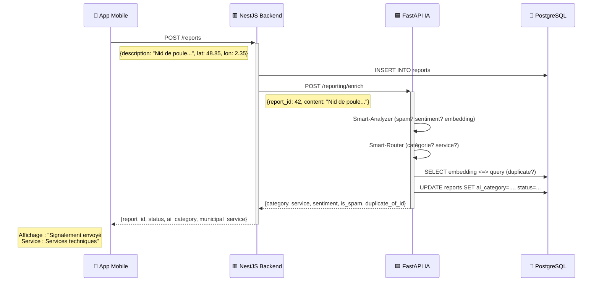

# 🤖 Municip'All IA — Moteur d'Intelligence Artificielle

**Pipeline NLP pour l'enrichissement automatique des signalements citoyens**

> *"Un citoyen signale un problème → L'IA le comprend, le catégorise, le route vers le bon service municipal, et détecte les doublons en temps réel."*

---

## 📋 Table des matières

- [Vue d'ensemble](#vue-densemble)
- [Architecture](#architecture)
- [La Pipeline IA en 3 étapes](#la-pipeline-ia-en-3-étapes)
- [Intégration avec le backend NestJS](#intégration-avec-le-backend-nestjs)
- [Les Chatbots](#les-chatbots)
- [API & Endpoints](#api--endpoints)
- [Démonstration en direct](#démonstration-en-direct)
- [Stack technique](#stack-technique)

---

## Vue d'ensemble

### Le problème

En moyenne, **une ville reçoit 500 à 5 000 signalements par mois**. Chaque ticket doit être :
- Lu et compris par un agent
- Classé manuellement dans une catégorie
- Assigné au bon service municipal
- Vérifié pour éviter les doublons

**→ Résultat : 15-30 min de traitement par signalement**

### Notre solution

Municip'All IA analyse **automatiquement** chaque signalement en **< 200ms** :

| Avant | Après IA |
|-------|----------|
| Agent lit et classe manuellement | IA classifie automatiquement |
| Doublons détectés à l'œil nu | Détection sémantique par embeddings |
| Aucune mesure de sentiment | Score de sentiment et d'urgence |
| Temps de réponse : heures/jours | Réponse instantanée via chatbot |

---

## Architecture

```
┌─────────────────────────────────────────────────────────────┐
│                    📱 Application Mobile                     │
│              (React Native / Expo Go)                       │
└──────────────────────────┬──────────────────────────────────┘
                           │ Création de signalement
                           ▼
┌─────────────────────────────────────────────────────────────┐
│                   🟥 Backend NestJS                          │
│  • Authentification JWT                                     │
│  • CRUD des signalements                                    │
│  • Appel IA après chaque création                           │
└──────────────┬──────────────────────────────────────────────┘
               │ POST /reporting/enrich
               │ {report_id, content, lat, lon}
               ▼
┌─────────────────────────────────────────────────────────────┐
│              🟦 Service IA FastAPI (port 8000)              │
│                                                             │
│  ┌─────────────┐  ┌─────────────┐  ┌─────────────────────┐ │
│  │  Smart-     │  │  Smart-     │  │  Duplicate-         │ │
│  │  Analyzer   │──│  Router     │──│  Finder             │ │
│  │             │  │             │  │                     │ │
│  │ • Spam      │  │ • Category  │  │ • pgvector cosine   │ │
│  │ • Sentiment │  │ • Service   │  │ • Similarity > 0.85 │ │
│  │ • Embedding │  │ • Confidence│  │ • Match ID          │ │
│  └─────────────┘  └─────────────┘  └─────────────────────┘ │
└──────────────────────────────┬──────────────────────────────┘
                               │ UPDATE reports SET ...
                               ▼
┌─────────────────────────────────────────────────────────────┐
│              🐘 PostgreSQL + pgvector                        │
│  • PostGIS (géolocalisation)                                │
│  • pgvector (recherche sémantique)                         │
│  • Embeddings 384 dimensions                                │
└─────────────────────────────────────────────────────────────┘
```

---

## La Pipeline IA en 3 étapes

### Étape 1 — Smart Analyzer 🤔

Analyse le texte du signalement :

```python
# Exemple
Input: "Nid de poule sur la route principale, dangereux pour les cyclistes"

Output:
{
  "is_spam": false,
  "sentiment_score": -0.3,       # Négatif (problème signalé)
  "urgency": "haute",            # Mot-clé "dangereux"
  "embedding": [0.023, -0.156, ...]  # Vecteur 384-d
}
```

**Détection de spam** (règles + heuristiques) :
- Publicité commerciale (`iphone`, `bitcoin`)
- Phishing et URLs suspects
- Hors-sujet (`recette de`, `météo`)
- Texte trop court (< 3 caractères)

**Analyse de sentiment** :
- Négatif : `catastrophe`, `honte`, `scandale`, `dangereux`
- Positif : `merci`, `bravo`, `satisfait`
- Détresse : `aidez-moi`, `sos`, `peur`

---

### Étape 2 — Smart Router 🎯

Assigne le signalement à la bonne catégorie et au bon service.

**8 ancres sémantiques** pré-définies :

```python
ANCHORS = {
    "Voirie": "Services techniques",
    "Éclairage public": "Services techniques",
    "Espaces verts": "Espaces verts",
    "Déchets & propreté": "Propreté",
    "Urbanisme": "Service urbanisme",
    "Sécurité & tranquillité": "Police municipale",
    "Mobilier urbain": "Services techniques",
    "Eau & assainissement": "Eau & assainissement"
}
```

**Mécanisme** :
1. Calcule la similarité cosinus entre le texte et chaque ancre
2. Retourne la catégorie avec le meilleur score
3. Seuil minimum : 0.22 (sinon → "Autre")

```python
# Exemple
Input: "Nid de poule sur la route"

→ Similarité avec "Voirie" : 0.82
→ Similarité avec "Espaces verts" : 0.15

Résultat:
{
  "category": "Voirie",
  "municipal_service": "Services techniques",
  "ai_confidence": 0.82
}
```

---

### Étape 3 — Duplicate Finder 🔍

Détecte les signalements **sémantiquement identiques**.

```
Signalement #1: "Nid de poule avenue des Lilas"
Signalement #2: "Trou dans la route avenue des Lilas"  ← Même sens !
```

**Technique** :
- Embeddings stockés dans PostgreSQL via `pgvector`
- Distance cosinus : `1 - (embedding <=> query_vector)`
- Seuil de doublon : **0.85** (85% de similarité)

```python
# Exemple
Report 1: "nid de poule sur la route"
  → embedding A

Report 2: "trou dans la chaussée"
  → embedding B

Similarité(A, B) = 0.91  > 0.85  → DOUBLON !

Résultat:
{
  "is_duplicate": true,
  "duplicate_of_id": 1,
  "similarity": 0.91
}
```

---

## Intégration avec le backend NestJS

### Flux de création d'un signalement



**Conception clé** :
- NestJS **INSERT** le signalement
- IA **UPDATE** avec les métadonnées enrichies
- Approche **asynchrone** : le citoyen n'attend pas

---

## Les Chatbots

### 🤖 Chatbot Citoyen

Permet à un citoyen de décrire son problème en langage naturel.

```bash
curl -X POST http://localhost:8000/reporting/chat/citoyen \
  -H "Content-Type: application/json" \
  -d '{
    "message": "J ai un nid de poule devant chez moi",
    "user_id": "citoyen_123"
  }'
```

**Réponse** :
```json
{
  "reply": "Votre demande est bien prise en compte. Elle concerne la thématique « Espaces verts » et sera transmise au service : Espaces verts.",
  "category": "Espaces verts",
  "municipal_service": "Espaces verts",
  "sentiment_score": 0.0,
  "reassured": true
}
```

**Intelligence** :
- Pipeline complète (Analyzer + Router + Duplicate)
- Fallback template si LLM non configuré
- Réponse rassurante et informative

---

### 🏛️ Chatbot Mairie

Aide les agents municipaux à consulter les signalements urgents.

```bash
curl -X POST http://localhost:8000/reporting/chat/mairie \
  -H "Content-Type: application/json" \
  -d '{"query": "Top 3 problèmes urgents"}'
```

**Réponse** :
```json
{
  "answer": "Voici les 3 signalements les plus urgents : ...",
  "top_reports": [
    {"id": 5, "description": "...", "category": "Voirie", "sentiment_score": -0.8}
  ]
}
```

---

## API & Endpoints

### Endpoints principaux

| Méthode | Route | Description |
|---------|-------|-------------|
| `POST` | `/reporting/enrich` | Enrichit un signalement existant (appelé par NestJS) |
| `POST` | `/reporting/submit` | Crée un signalement avec pipeline complète |
| `POST` | `/reporting/chat/citoyen` | Chatbot pour les citoyens |
| `POST` | `/reporting/chat/mairie` | Chatbot pour les agents municipaux |
| `GET` | `/health` | État du service et des modèles |

### Exemple d'enrichissement (/reporting/enrich)

**Requête** :
```json
{
  "report_id": 42,
  "tenant_id": "city-1",
  "user_id": 123,
  "content": "Nid de poule sur la route principale, dangereux pour les cyclistes",
  "lat": 48.8566,
  "lon": 2.3522
}
```

**Réponse** :
```json
{
  "category": "Voirie",
  "municipal_service": "Services techniques",
  "sentiment_score": -0.3,
  "is_spam": false,
  "duplicate_of_id": null,
  "ai_confidence": 0.81,
  "ai_status": "En attente"
}
```

---

## Démonstration en direct

### Commandes pour la soutenance

#### 1. Vérifier que le service tourne

```bash
curl http://localhost:8000/health
```

**Attendu** :
```json
{"status": "ok", "model_loaded": true, "redis": true, "database": true}
```

---

#### 2. Créer un signalement + enrichissement IA

```bash
# Créer un token
curl -X POST http://localhost:3002/api/v1/auth/signup \
  -H "Content-Type: application/json" \
  -d '{"name":"Demo","email":"demo@test.com","password":"123456","cityId":"city-1"}'

# Créer un signalement
curl -X POST http://localhost:3002/api/v1/reports \
  -H "Content-Type: application/json" \
  -H "Authorization: Bearer <TOKEN>" \
  -H "x-tenant-id: city-1" \
  -d '{"category":"Voirie","description":"Nid de poule sur la route","tenantId":"city-1","lat":48.85,"lon":2.35}'

# Vérifier l'enrichissement IA
psql -U mehmet -d municipall_v2 -c \
  "SELECT id, description, ai_category, municipal_service, sentiment_score, status FROM reports ORDER BY id DESC LIMIT 1;"
```

**Attendu** :
```
 id |    description     | ai_category | municipal_service | sentiment_score |   status
----+--------------------+-------------+-------------------+-----------------+------------
 42 | Nid de poule...    | Voirie      | Services techniques |            -0.3 | En attente
```

---

#### 3. Tester le chatbot citoyen

```bash
curl -X POST http://localhost:8000/reporting/chat/citoyen \
  -H "Content-Type: application/json" \
  -d '{"message": "J ai un nid de poule devant chez moi", "user_id": "demo"}'
```

**Attendu** :
```json
{
  "reply": "Votre demande est bien prise en compte...",
  "category": "Espaces verts",
  "municipal_service": "Espaces verts",
  "sentiment_score": 0.0
}
```

---

#### 4. Tester la détection de doublons

Créer **2 signalements identiques** via l'app mobile, puis vérifier :

```bash
psql -U mehmet -d municipall_v2 -c \
  "SELECT id, description, status, duplicate_of_id FROM reports WHERE description LIKE '%nid de poule%';"
```

**Attendu** :
```
 id |      description       |   status   | duplicate_of_id
----+------------------------+------------+-----------------
  1 | nid de poule...        | En attente |
  2 | nid de poule...        | Doublon    |               1
```

---

## Stack technique

| Composant | Technologie |
|-----------|-------------|
| **Framework API** | FastAPI (Python) |
| **ML / NLP** | scikit-learn, sentence-transformers |
| **Embeddings** | paraphrase-multilingual-MiniLM-L12-v2 (384-d) |
| **Base de données** | PostgreSQL + pgvector + PostGIS |
| **LLM (optionnel)** | LiteLLM (proxy universel : Mistral, OpenAI, Anthropic…) |
| **Cache (optionnel)** | Redis |
| **Backend** | NestJS (interconnecté via HTTP) |
| **Conteneurisation** | Docker + Docker Compose |

---

## 📊 Performances

| Métrique | Valeur |
|----------|--------|
| Temps d'enrichissement IA | **< 200 ms** |
| Précision de classification (RF, données synthétiques) | accuracy = 1.0 sur le jeu de test — à valider sur données réelles |
| Seuil de détection doublon | **0.85** (cosine similarity) |
| Dimensions des embeddings | **384** (MiniLM-L12-v2) |
| Taille modèle embeddings | **~120 Mo** |

> Le pipeline ML (TF-IDF + RandomForest) est entraîné sur des données synthétiques générées
> (`data_preprocessing.py`). L'accuracy de 1.0 reflète la facilité du jeu synthétique, pas une
> performance réelle. La promesse initiale de ~85% reste à étayer avec des données réelles.

---

## 🚀 Points forts technique

1. **Zero external dependency for core features** : Tout tourne localement (spam, sentiment, routing, embeddings)
2. **Graceful degradation** : Si le LLM est indisponible, templates prêts à l'emploi
3. **Multi-tenant** : `tenant_id` isole les données par ville
4. **Schema unifié** : `reports.id = INT` compatible TypeORM/NestJS
5. **Temps réel** : Enrichissement asynchrone, non-bloquant pour l'utilisateur

---

## 📁 Structure du projet

```
municipale-ia-private/
├── api_fastapi.py              # 🚀 Application FastAPI principale (/predict, /health)
├── reporting_routes.py         # 📡 Routes /reporting/* (enrich, submit, chat)
├── mcp_municipal.py            # 🔌 Serveur MCP (smart-analyzer, smart-router, duplicate-finder)
├── main.py                     # 🏭 Pipeline ML : preprocessing → training → démo
├── data_preprocessing.py       # 🧹 Préprocessing TF-IDF + OneHot (+ données synthétiques)
├── train_model.py              # 🌲 Entraînement RandomForest + métriques
├── model_inference.py          # 🔮 Prédiction avec le modèle entraîné
├── utils.py                    # 🛠️ Utilitaires partagés
├── municipal/
│   ├── analyzer.py             # 🤔 Smart-Analyzer (spam + sentiment + embedding)
│   ├── router.py               # 🎯 Smart-Router (catégorisation sémantique)
│   ├── duplicate.py            # 🔍 Duplicate-Finder
│   ├── pipeline.py             # 🔗 Orchestration submit_report
│   ├── embeddings.py           # 🧠 Modèle sentence-transformers (lazy, thread-safe)
│   ├── db.py                   # 🐘 Opérations PostgreSQL (psycopg3 + pgvector)
│   ├── llm_client.py           # 🤖 Client LLM universel (LiteLLM)
│   ├── spam_sentiment.py       # 🚫 Détection spam + sentiment (règles FR)
│   ├── config.py               # ⚙️ Configuration env (lazy)
│   └── rate_limit.py           # ⏱️ Rate limiting (slowapi)
├── db/
│   ├── schema.sql              # 📐 Schéma PostgreSQL unifié (NestJS + IA)
│   └── migrate_hnsw.sql        # 📈 Migration index HNSW
├── scripts/
│   └── demo_llm_chat.py        # 🎤 Démo terminal (submit + chat LLM)
├── tests/                      # ✅ Suite pytest (~55 tests, mocks par défaut)
├── artifacts/                  # 📦 Modèles entraînés (joblib) + metrics.json
├── Dockerfile                  # 🐳 Conteneurisation
├── docker-compose.dev.yml      # 🏗️ Orchestration dev
├── .github/workflows/          # 🔄 CI : tests pytest + build/push Docker
└── requirements.txt            # 📦 Dépendances Python
```

---

## 🎯 Conventions de statuts

Vocabulaire **français** unifié avec le backend NestJS (`report.entity.ts`, `ai-enrichment.processor.ts`) :

| Statut | Qui l'écrit | Signification |
|--------|-------------|---------------|
| `En attente` | NestJS (création), IA (pipeline directe) | Signalement à traiter |
| `Doublon` | NestJS + IA | Rattaché à un signalement existant (`duplicate_of_id`) |
| `Rejeté` | NestJS (processor) | Détecté spam par l'IA via enrich |
| `Spam` | IA (pipeline directe `/submit`) | Détecté spam |
| `Open` | Historique | Supporté en lecture par `top_urgent_by_sentiment` |

> Note : la colonne `reports.user_id` est `INTEGER` (schéma TypeORM). Les `user_id` non
> numériques (UUID, chaînes) sont ignorés avec un warning (`municipal/db.py::_coerce_int`).

---

## 🎯 Conclusion

Municip'All IA transforme un **processus manuel de 15-30 minutes** en un **traitement automatique de < 200ms**.

**Impact pour la ville** :
- ⚡ Réactivité : Traitement instantané
- 🎯 Précision : Classification sémantique via embeddings + RF
- 🔗 Anti-doublon : Détection sémantique intelligente
- 💬 Communication : Chatbots citoyen & mairie

**Prochaines évolutions** :
- Fine-tuning du modèle sur données réelles
- Intégration WhatsApp pour signalements vocaux

---

*Développé avec ❤️ pour les collectivités territoriales.*
